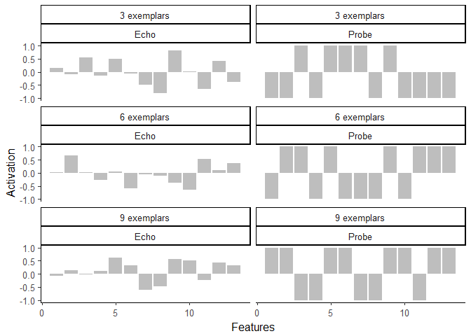
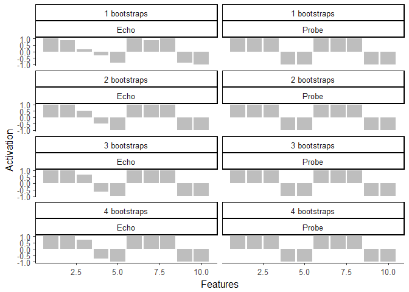
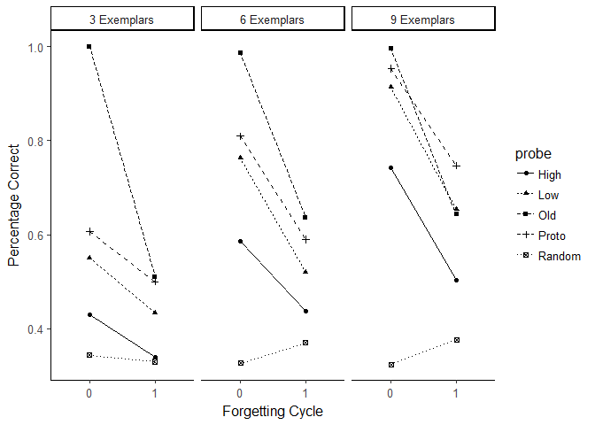

HINTZMAN 1986 Replications
---------------------


# Simulation 1: Probing memory with a category name to retrieve the prototype

Each memory trace and each probe was a 23 unit vector. 1-10 represented the category name, and 11-23 represented the stimulus pattern


```r
#set.seed(32468)
# create prototypes
# 1:10 = category name
# 11:23 = exemplar of category
prototypes <- matrix(sample(c(1,-1),size=3*23,replace = TRUE), nrow=3)

# each category has a different frequency of occurence (3, 6, or 9)
memory <- prototypes
memory <- memory[rep(1:nrow(memory), times = c(3,6,9)), ]


# each exemplar is distorted by randomly reversing the sign of four items (high distortion)
for (i in seq(1:nrow(memory))){
  s<-sample(seq(11,23),4,replace = FALSE)
  memory[i,s]<-memory[i,s]*-1
}

# probe memory with category name of the 3rd category (9 exemplars in memory)
df <- data.frame()
for (i in 1:3){
    probe <- prototypes[i,]
    probe[11:23]<-0

    echo <- get_echo(probe, memory)

    exemplars   <- rep(paste0(i*3, " exemplars"), 26)
    activations <- c(prototypes[i,11:23],echo$content[11:23])
    cue         <- rep(c("Probe","Echo"),each=13)
    feature     <- rep(seq(1:13),2)

    df          <- rbind(df, data.frame(exemplars, cue, feature, activations))
    
    print(cor(echo$content[11:23], prototypes[i,11:23]))

}
```

```
## [1] 0.4594182
## [1] 0.6189433
## [1] 0.7765922
```

```r
ggplot(data=df, aes(y=activations,x=feature))+
  geom_bar(stat="identity",position=position_dodge(),fill="gray")+
  theme_classic(base_size=12) +
  ylab("Activation") + xlab("Features")+
  facet_wrap(exemplars~cue, ncol = 2) 
```

<!-- -->

# 1986 Simulation #2 

Correlations between echo and prototype vary as a function of the number of exemplars stored in memory

Run 20 'subjects' / mean correlations for 3, 6, and 9 item


```r
set.seed(32468)
c1<-c()
c2<-c()
c3<-c()


for (i in 1:20){
    
  prototypes <- matrix(sample(c(1,-1),size=3*23,replace = TRUE), nrow=3)

  memory <- prototypes
  memory <- memory[rep(1:nrow(memory), times = c(3,6,9)), ]


#high distort
for (i in seq(1:nrow(memory))){
  s<-sample(seq(11,23),4,replace = FALSE)
  memory[i,s]<-memory[i,s]*-1
}


probe <- prototypes[1,]
probe[11:23]<-0
echo<-get_echo(probe, memory)
c1<-c(c1,cor(prototypes[1,11:23],echo$content[11:23]))

probe <- prototypes[2,]
probe[11:23]<-0
echo<-get_echo(p = probe,m = memory)
c2<-c(c2,cor(prototypes[2,11:23],echo$content[11:23]))

probe <- prototypes[3,]
probe[11:23]<-0
echo<-get_echo(probe, memory)
c3<-c(c3,cor(prototypes[3,11:23],echo$content[11:23]))
}


mean(c1)
```

```
## [1] 0.5850717
```

```r
mean(c2)
```

```
## [1] 0.7106258
```

```r
mean(c3)
```

```
## [1] 0.7809507
```

```r
print("Hintzman's results: .62, .73, .79")
```

```
## [1] "Hintzman's results: .62, .73, .79"
```

# Simulation 3: Cuing memory with the prototype to retrieve the category name


```r
c1<-c()
c2<-c()
c3<-c()


for (i in 1:20){
  prototypes <- matrix(sample(c(1,-1),size=3*23,replace = TRUE), nrow=3)
  memory <- prototypes
  memory <- memory[rep(1:nrow(memory), times = c(3,6,9)), ]


#high distort
for (i in seq(1:nrow(memory))){
  s<-sample(seq(11,23),4,replace = FALSE)
  memory[i,s]<-memory[i,s]*-1
}


probe <- prototypes[1,]
probe[1:10]<-0
echo<-get_echo(probe, memory)
c1<-c(c1,cor(prototypes[1,1:10],echo$content[1:10]))

probe <- prototypes[2,]
probe[1:10]<-0
echo<-get_echo(p = probe,m = memory)
c2<-c(c2,cor(prototypes[2,1:10],echo$content[1:10]))

probe <- prototypes[3,]
probe[1:10]<-0
echo<-get_echo(probe, memory)
c3<-c(c3,cor(prototypes[3,1:10],echo$content[1:10]))
}


mean(c1)
```

```
## [1] 0.5683128
```

```r
mean(c2)
```

```
## [1] 0.7360027
```

```r
mean(c3)
```

```
## [1] 0.9141967
```

```r
print("Hintzman's results: .58, .83, .88")
```

```
## [1] "Hintzman's results: .58, .83, .88"
```

# Simulation 4: Deblurring the echo

Retrieved echoes are not exactly like their probe. But resubmitting the retrieved echo as a probe (deblurring / bootstrapping) can clean up the retieval process until it retrieves a perfect copy.


```r
set.seed(1070)
# create prototypes
# 1:10 = category name
# 11:23 = exemplar of category
prototypes <- matrix(sample(c(1,-1),size=3*23,replace = TRUE), nrow=3)

# each category has a different frequency of occurence (3, 6, or 9)
memory <- prototypes
memory <- memory[rep(1:nrow(memory), times = c(3,6,9)), ]


# each exemplar is distorted by randomly reversing the sign of four items (high distortion)
for (i in seq(1:nrow(memory))){
  s<-sample(seq(11,23),4,replace = FALSE)
  memory[i,s]<-memory[i,s]*-1
}

  
# probe memory with category name of the 3rd category (9 exemplars in memory)
    probe <- prototypes[3,]
    probe[1:10]<-0

df <- data.frame()
for (i in 1:4){
    echo <- get_echo(probe, memory, normalize = TRUE)

    exemplars   <- rep(paste0(i, " bootstraps"), 20)
    activations <- c(prototypes[3,1:10],echo$content[1:10])
    cue         <- rep(c("Probe","Echo"),each=10)
    feature     <- rep(seq(1:10),2)

    df          <- rbind(df, data.frame(exemplars, cue, feature, activations))
    
    probe       <- echo$content/max(abs(echo$content))
    print(cor(echo$content[1:10], prototypes[3,1:10]))

}
```

```
## [1] 0.9374732
## [1] 0.9755761
## [1] 0.9887008
## [1] 0.9935813
```

```r
ggplot(data=df, aes(y=activations,x=feature))+
  geom_bar(stat="identity",position=position_dodge(),fill="gray")+
  theme_classic(base_size=12) +
  ylab("Activation") + xlab("Features")+
  facet_wrap(exemplars~cue, ncol = 2) 
```

<!-- -->

# Simulation #5: classification with forgetting

Hintzman Figure 5


```r
classify <- function(memory = NULL, probe = NULL){
    probe[1:10]<-0
    echo<-get_echo(p = probe,m = memory)
    m <- which.max(c(cor(prototypes[1,1:10],echo$content[1:10]),
               cor(prototypes[2,1:10],echo$content[1:10]),
               cor(prototypes[3,1:10],echo$content[1:10])))
    
    return(m)
}

df<-c()
for (n in 1:300){
  prototypes <- matrix(sample(c(1,-1),size=3*23,replace = TRUE), nrow=3)
  memory <- prototypes
  memory <- memory[rep(1:nrow(memory), times = c(3,6,9)), ]


# Distort memory 
for (i in seq(1:nrow(memory))){
  s<-sample(seq(11,23),4,replace = FALSE)
  memory[i,s]<-memory[i,s]*-1
}

  
    # (a) old exemplar
    t_exemplars <- rbind(memory[1,],memory[4,], memory[10,])
    
    # (b) category prototype
    # prototypes
    
    # (c) new low level distortion prototype
    t_low <- prototypes
    for (i in seq(1:nrow(t_low))) {
    s  <- sample(seq(11, 23), 2, replace = FALSE)
    t_low[i, s] <- t_low[i, s] * -1
    }
    
    # (d) new high level distortion prototype
    t_high <- prototypes
    for (i in seq(1:nrow(t_high))) {
    s  <- sample(seq(11, 23), 4, replace = FALSE)
    t_high[i, s] <- t_high[i, s] * -1
    }
    
    # (e) random pattern
    t_random <- matrix(sample(c(1, -1), size = 3 * 23, replace = TRUE), nrow =
    3)
## test category prototypes- 
df<-rbind(df, 
      c(n, "0","Proto","3 Exemplars",classify(memory, prototypes[1,]) == 1),
      c(n, "0","Proto","6 Exemplars",classify(memory, prototypes[2,]) == 2),
      c(n, "0","Proto","9 Exemplars",classify(memory, prototypes[3,]) == 3),

      c(n, "0","Old","3 Exemplars",classify(memory, t_exemplars[1,]) == 1),
      c(n, "0","Old","6 Exemplars",classify(memory, t_exemplars[2,]) == 2),
      c(n, "0","Old","9 Exemplars",classify(memory, t_exemplars[3,]) == 3),
      
      c(n, "0","Low","3 Exemplars",classify(memory, t_low[1,]) == 1),
      c(n, "0","Low","6 Exemplars",classify(memory, t_low[2,]) == 2),
      c(n, "0","Low","9 Exemplars",classify(memory, t_low[3,]) == 3),
      
      c(n, "0","High","3 Exemplars",classify(memory, t_high[1,]) == 1),
      c(n, "0","High","6 Exemplars",classify(memory, t_high[2,]) == 2),
      c(n, "0","High","9 Exemplars",classify(memory, t_high[3,]) == 3),
      
      c(n, "0","Random","3 Exemplars",classify(memory, t_random[1,]) == 1),
      c(n, "0","Random","6 Exemplars",classify(memory, t_random[2,]) == 2),
      c(n, "0","Random","9 Exemplars",classify(memory, t_random[3,]) == 3)
    )


memory <- forget(memory, forgetting_rate = .75)

df<-rbind(df, 
      c(n, "1","Proto","3 Exemplars",classify(memory, prototypes[1,]) == 1),
      c(n, "1","Proto","6 Exemplars",classify(memory, prototypes[2,]) == 2),
      c(n, "1","Proto","9 Exemplars",classify(memory, prototypes[3,]) == 3),

      c(n, "1","Old","3 Exemplars",classify(memory, t_exemplars[1,]) == 1),
      c(n, "1","Old","6 Exemplars",classify(memory, t_exemplars[2,]) == 2),
      c(n, "1","Old","9 Exemplars",classify(memory, t_exemplars[3,]) == 3),
      
      c(n, "1","Low","3 Exemplars",classify(memory, t_low[1,]) == 1),
      c(n, "1","Low","6 Exemplars",classify(memory, t_low[2,]) == 2),
      c(n, "1","Low","9 Exemplars",classify(memory, t_low[3,]) == 3),
      
      c(n, "1","High","3 Exemplars",classify(memory, t_high[1,]) == 1),
      c(n, "1","High","6 Exemplars",classify(memory, t_high[2,]) == 2),
      c(n, "1","High","9 Exemplars",classify(memory, t_high[3,]) == 3),
      
      c(n, "1","Random","3 Exemplars",classify(memory, t_random[1,]) == 1),
      c(n, "1","Random","6 Exemplars",classify(memory, t_random[2,]) == 2),
      c(n, "1","Random","9 Exemplars",classify(memory, t_random[3,]) == 3)
    )


}


summary <- as.data.frame(df) %>%
    rename(
        subject = V1,
        forgetting_cycle = V2,
        probe = V3,
        exemplars = V4,
        acc = V5
    ) %>%
    mutate(acc = as.logical(acc)) %>%
    group_by(forgetting_cycle,probe,exemplars) %>%
    summarize(
        accuracy = sum(acc)/n()
    )


ggplot(summary, aes(x=forgetting_cycle, y=accuracy, group=probe)) +
  geom_line(aes(linetype=probe))+
  geom_point(aes(shape=probe)) +
  theme_classic(base_size=12) +
  ylab("Percentage Correct") + xlab("Forgetting Cycle")+
  facet_wrap(~exemplars)
```

<!-- -->
