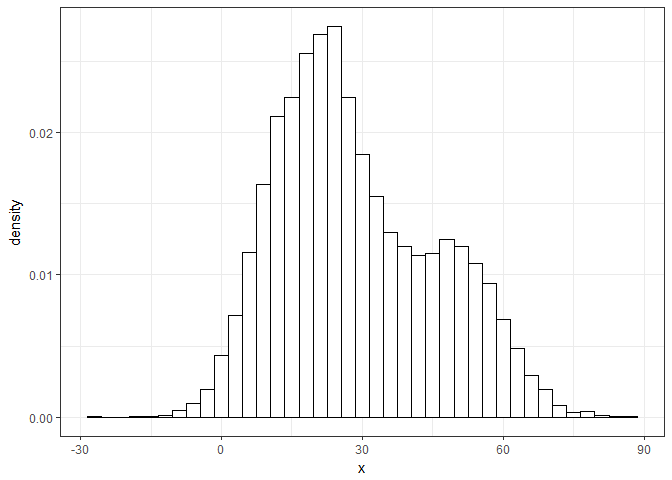
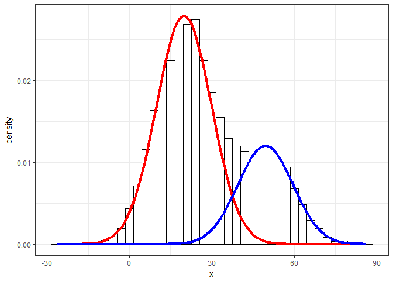
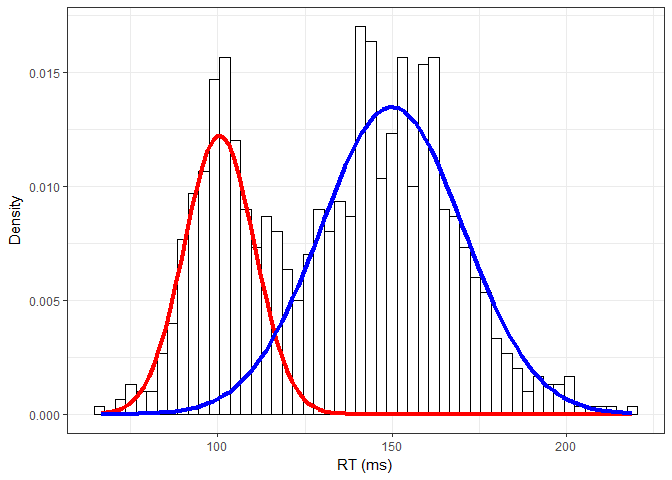
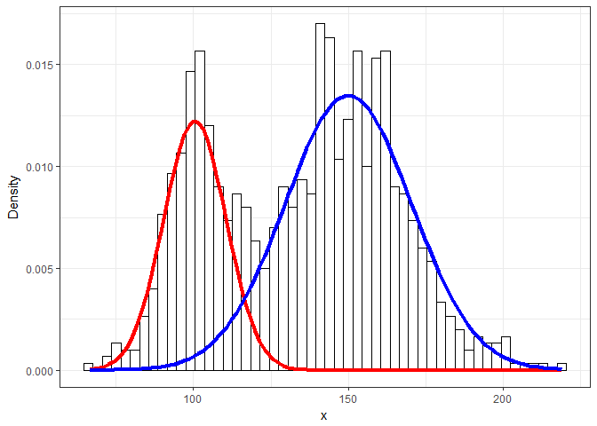

## Simplified Expectation Maximization example

1. estimate the probabilities (expectation)
2. estimate the parameters (maximization)
3. repeat


```r
expectation <- function(data, means, proportions, sds){
  # Estimate the probabilities
  exp_data <- data %>% 
    mutate(prob_from_cluster1 = proportions[1] * dnorm(x, mean = means[1], sd = sds[1]),
           prob_from_cluster2 = proportions[2] * dnorm(x, mean = means[2], sd = sds[2]),
           prob_cluster1 = prob_from_cluster1/(prob_from_cluster1 + prob_from_cluster2),
           prob_cluster2 = prob_from_cluster2/(prob_from_cluster1 + prob_from_cluster2)) %>% 
    select(x, prob_cluster1, prob_cluster2)
    
  # Return data with probabilities
  return(exp_data)
}

maximization <- function(data_with_probs){
  means_estimates <- data_with_probs %>%
    summarise(mean_1 = sum(x * prob_cluster1) / sum(prob_cluster1),
              mean_2 = sum(x * prob_cluster2) / sum(prob_cluster2)) %>% 
    as.numeric()
  props_estimates <- data_with_probs %>% 
    summarise(proportion_1 = mean(prob_cluster1),
              proportion_2 = 1 - proportion_1) %>% 
    as.numeric()
  list(means_estimates, props_estimates)   
}

fun_gaussian <- function(x, mean, proportion){
  proportion * dnorm(x, mean, sd = 10)
}
```

# Create two gaussian distributions


```r
gaussian_sample <- data.frame(x = c(rnorm(7000, 20, 10), rnorm(3000, 50, 10)))

gaussian_sample %>% 
  ggplot() + geom_histogram(aes(x = x, y = ..density..), binwidth = 3, colour = "black", 
                 fill = "white") +
  theme_bw()
```

<!-- -->

# Fit mixture model using expectation maximization function


```r
means_init <- c(0, 100)
props_init <- c(0.5, 0.5)

# Iterative process
for(i in 1:100){
  new_values <- maximization(expectation(gaussian_sample, means_init, props_init, c(10, 10)))
  means_init <- new_values[[1]]
  props_init <- new_values[[2]]
  cat(c(i, means_init, props_init), "\n")
}
```

```
## 1 23.83666 57.68593 0.8538853 0.1461147 
## 2 22.55439 54.49618 0.8050159 0.1949841 
## 3 21.57573 52.77472 0.7690053 0.2309947 
## 4 20.95772 51.66573 0.7451866 0.2548134 
## 5 20.5707 50.93954 0.7295967 0.2704033 
## 6 20.32417 50.46138 0.7193383 0.2806617 
## 7 20.16443 50.14473 0.7125411 0.2874589 
## 8 20.05956 49.93393 0.7080115 0.2919885 
## 9 19.99009 49.793 0.7049804 0.2950196 
## 10 19.94377 49.6985 0.7029459 0.2970541 
## 11 19.91275 49.63497 0.7015775 0.2984225 
## 12 19.89193 49.59221 0.7006559 0.2993441 
## 13 19.87792 49.56339 0.7000345 0.2999655 
## 14 19.86848 49.54395 0.6996154 0.3003846 
## 15 19.86211 49.53083 0.6993325 0.3006675 
## 16 19.85782 49.52198 0.6991415 0.3008585 
## 17 19.85492 49.516 0.6990125 0.3009875 
## 18 19.85296 49.51196 0.6989254 0.3010746 
## 19 19.85164 49.50923 0.6988666 0.3011334 
## 20 19.85075 49.50739 0.6988269 0.3011731 
## 21 19.85015 49.50615 0.6988 0.3012 
## 22 19.84974 49.50531 0.6987819 0.3012181 
## 23 19.84946 49.50474 0.6987697 0.3012303 
## 24 19.84928 49.50436 0.6987614 0.3012386 
## 25 19.84915 49.5041 0.6987558 0.3012442 
## 26 19.84907 49.50392 0.698752 0.301248 
## 27 19.84901 49.5038 0.6987495 0.3012505 
## 28 19.84897 49.50372 0.6987477 0.3012523 
## 29 19.84895 49.50367 0.6987466 0.3012534 
## 30 19.84893 49.50363 0.6987458 0.3012542 
## 31 19.84892 49.50361 0.6987453 0.3012547 
## 32 19.84891 49.50359 0.6987449 0.3012551 
## 33 19.8489 49.50358 0.6987447 0.3012553 
## 34 19.8489 49.50357 0.6987445 0.3012555 
## 35 19.8489 49.50357 0.6987444 0.3012556 
## 36 19.8489 49.50356 0.6987443 0.3012557 
## 37 19.84889 49.50356 0.6987443 0.3012557 
## 38 19.84889 49.50356 0.6987442 0.3012558 
## 39 19.84889 49.50356 0.6987442 0.3012558 
## 40 19.84889 49.50356 0.6987442 0.3012558 
## 41 19.84889 49.50356 0.6987442 0.3012558 
## 42 19.84889 49.50356 0.6987442 0.3012558 
## 43 19.84889 49.50356 0.6987442 0.3012558 
## 44 19.84889 49.50356 0.6987442 0.3012558 
## 45 19.84889 49.50356 0.6987442 0.3012558 
## 46 19.84889 49.50356 0.6987442 0.3012558 
## 47 19.84889 49.50356 0.6987442 0.3012558 
## 48 19.84889 49.50356 0.6987442 0.3012558 
## 49 19.84889 49.50356 0.6987442 0.3012558 
## 50 19.84889 49.50356 0.6987442 0.3012558 
## 51 19.84889 49.50356 0.6987442 0.3012558 
## 52 19.84889 49.50356 0.6987442 0.3012558 
## 53 19.84889 49.50356 0.6987442 0.3012558 
## 54 19.84889 49.50356 0.6987442 0.3012558 
## 55 19.84889 49.50356 0.6987442 0.3012558 
## 56 19.84889 49.50356 0.6987442 0.3012558 
## 57 19.84889 49.50356 0.6987442 0.3012558 
## 58 19.84889 49.50356 0.6987442 0.3012558 
## 59 19.84889 49.50356 0.6987442 0.3012558 
## 60 19.84889 49.50356 0.6987442 0.3012558 
## 61 19.84889 49.50356 0.6987442 0.3012558 
## 62 19.84889 49.50356 0.6987442 0.3012558 
## 63 19.84889 49.50356 0.6987442 0.3012558 
## 64 19.84889 49.50356 0.6987442 0.3012558 
## 65 19.84889 49.50356 0.6987442 0.3012558 
## 66 19.84889 49.50356 0.6987442 0.3012558 
## 67 19.84889 49.50356 0.6987442 0.3012558 
## 68 19.84889 49.50356 0.6987442 0.3012558 
## 69 19.84889 49.50356 0.6987442 0.3012558 
## 70 19.84889 49.50356 0.6987442 0.3012558 
## 71 19.84889 49.50356 0.6987442 0.3012558 
## 72 19.84889 49.50356 0.6987442 0.3012558 
## 73 19.84889 49.50356 0.6987442 0.3012558 
## 74 19.84889 49.50356 0.6987442 0.3012558 
## 75 19.84889 49.50356 0.6987442 0.3012558 
## 76 19.84889 49.50356 0.6987442 0.3012558 
## 77 19.84889 49.50356 0.6987442 0.3012558 
## 78 19.84889 49.50356 0.6987442 0.3012558 
## 79 19.84889 49.50356 0.6987442 0.3012558 
## 80 19.84889 49.50356 0.6987442 0.3012558 
## 81 19.84889 49.50356 0.6987442 0.3012558 
## 82 19.84889 49.50356 0.6987442 0.3012558 
## 83 19.84889 49.50356 0.6987442 0.3012558 
## 84 19.84889 49.50356 0.6987442 0.3012558 
## 85 19.84889 49.50356 0.6987442 0.3012558 
## 86 19.84889 49.50356 0.6987442 0.3012558 
## 87 19.84889 49.50356 0.6987442 0.3012558 
## 88 19.84889 49.50356 0.6987442 0.3012558 
## 89 19.84889 49.50356 0.6987442 0.3012558 
## 90 19.84889 49.50356 0.6987442 0.3012558 
## 91 19.84889 49.50356 0.6987442 0.3012558 
## 92 19.84889 49.50356 0.6987442 0.3012558 
## 93 19.84889 49.50356 0.6987442 0.3012558 
## 94 19.84889 49.50356 0.6987442 0.3012558 
## 95 19.84889 49.50356 0.6987442 0.3012558 
## 96 19.84889 49.50356 0.6987442 0.3012558 
## 97 19.84889 49.50356 0.6987442 0.3012558 
## 98 19.84889 49.50356 0.6987442 0.3012558 
## 99 19.84889 49.50356 0.6987442 0.3012558 
## 100 19.84889 49.50356 0.6987442 0.3012558
```


# Plot estimated parameters over data


```r
gaussian_sample %>% 
  ggplot() + geom_histogram(aes(x = x, y = ..density..), binwidth = 3, colour = "black", 
                 fill = "white") +
  stat_function(geom = "line", fun = fun_gaussian,
                args = list(mean = means_init[1], proportion = props_init[1]),
                colour = "red", lwd = 1.5) +
  stat_function(geom = "line", fun = fun_gaussian,
                args = list(mean = means_init[2], proportion = props_init[2]),
                colour = "blue", lwd = 1.5) +
  theme_bw()
```

<!-- -->

# Gaussian mixture model example #2

## Create two gaussian distributions


```r
# generate some data
set.seed(1523444)

# settings for data simulation:
N_samples    <- 1000       # number of total samples
prob1        <- 0.3        # probability of sampling from dist. 1 
prob2        <- 1 - prob1  # probability of sampling from dist. 2

sample_dist <- data.frame(
  mean = c(100,150),
  sd    = c(10, 20)
)

# create N_samples of prob1 and prob2
whichD <- sample(c(1,2),N_samples, replace=TRUE, prob=c(prob1, prob2))

# replace with samples from distribution
dat <- sapply(whichD, function(x) 
  rnorm(1,sample_dist$mean[x],sample_dist$sd[x]))

glimpse(dat)
```

```
##  num [1:1000] 96.5 107.2 142.3 115.8 151.6 ...
```
# Fit mixture model using expectation maximization function


```r
# simulation starts with some guessed parameters
mu1    <- mean(dat,1)*0.8  # guess that dist1 has a mean smaller than the total sample average 
mu2    <- mean(dat,1)*1.2  # guess that dist2 has a mean larger than the total sample average
sd1    <- sd(dat)          # guess that sd = sample sd
sd2    <- sd(dat)
est_prop  <- 0.5           # guess the proportion of samples belonging to dist1
old_prop  <- 0             # placeholder for previous estimation


# function needed for the estimation maximization
# analogous to the weighted.mean function
weighted.sd <- function(x,w,mu = mean(x)){
  wvar <- sum(w*(x-mu)^2)/ sum(w)
  return(sqrt(wvar))
}

# iterate until threshold is reached
while (abs(est_prop-old_prop)>.00001){
  
  old_prop <- est_prop
  
  # Estimate the probabilities (expectation)
  resp <- est_prop*dnorm(dat,mu2,sd2)/
    ((1-est_prop)*dnorm(dat,mu1,sd1) + est_prop*dnorm(dat,mu2,sd2))
  
  # Estimate the parameters (maximization)
  mu1 <- weighted.mean(dat,1-resp)
  mu2 <- weighted.mean(dat,resp)
  
  sd1 <- weighted.sd(dat,1-resp,mu1)
  sd2 <- weighted.sd(dat,resp,mu2)
  
  est_prop <- mean(resp)
  print(est_prop)
  
}
```

```
## [1] 0.4623799
## [1] 0.4671067
## [1] 0.4716932
## [1] 0.4774119
## [1] 0.4846641
## [1] 0.4934057
## [1] 0.5033818
## [1] 0.5142736
## [1] 0.5257858
## [1] 0.5376797
## [1] 0.5497671
## [1] 0.5618899
## [1] 0.5738993
## [1] 0.5856441
## [1] 0.5969684
## [1] 0.6077191
## [1] 0.6177586
## [1] 0.6269795
## [1] 0.6353156
## [1] 0.6427458
## [1] 0.6492901
## [1] 0.6550003
## [1] 0.659948
## [1] 0.6642141
## [1] 0.6678807
## [1] 0.6710263
## [1] 0.6737224
## [1] 0.6760326
## [1] 0.6780126
## [1] 0.6797103
## [1] 0.681167
## [1] 0.6824178
## [1] 0.6834926
## [1] 0.6844168
## [1] 0.6852122
## [1] 0.6858971
## [1] 0.6864872
## [1] 0.686996
## [1] 0.6874349
## [1] 0.6878136
## [1] 0.6881406
## [1] 0.6884229
## [1] 0.6886668
## [1] 0.6888776
## [1] 0.6890598
## [1] 0.6892173
## [1] 0.6893535
## [1] 0.6894713
## [1] 0.6895731
## [1] 0.6896613
## [1] 0.6897375
## [1] 0.6898035
## [1] 0.6898605
## [1] 0.6899099
## [1] 0.6899527
## [1] 0.6899896
## [1] 0.6900217
## [1] 0.6900494
## [1] 0.6900733
## [1] 0.6900941
## [1] 0.6901121
## [1] 0.6901276
## [1] 0.6901411
## [1] 0.6901528
## [1] 0.6901628
## [1] 0.6901716
```

```r
df <- data.frame(rt=dat)
```

# Plot estimated parameters over data


```r
ggplot(df, aes(x = rt)) + 
  geom_histogram(aes(y = ..density..), colour = "black", fill = "white", binwidth = 3) + 
  stat_function(fun = function(k) (1-est_prop)*dnorm(k,mu1,sd1),
                colour = "red", lwd = 1.5) +
  stat_function(fun = function(k) est_prop*dnorm(k,mu2,sd2),
                colour = "blue", lwd = 1.5) +
  xlab("RT (ms)") + ylab("Density") +
  theme_bw()
```

<!-- -->

```r
# mixtools for comparison
```

# Run same as above, but with the mixtools library


```r
plot_mix_comps <- function(x, mu, sigma, lam) {
  lam * dnorm(x, mu, sigma)
}


mixmdl <- normalmixEM( dat, mu = c(1,4),
                     sigma=c(sd(dat),sd(dat)))
```

```
## number of iterations= 253
```

```r
data.frame(x = mixmdl$x) %>%
  ggplot() +
  geom_histogram(aes(x, ..density..), binwidth = 3, colour = "black", 
                 fill = "white") +
  stat_function(geom = "line", fun = plot_mix_comps,
                args = list(mixmdl$mu[1], mixmdl$sigma[1], lam = mixmdl$lambda[1]),
                colour = "red", lwd = 1.5) +
  stat_function(geom = "line", fun = plot_mix_comps,
                args = list(mixmdl$mu[2], mixmdl$sigma[2], lam = mixmdl$lambda[2]),
                colour = "blue", lwd = 1.5) +
  ylab("Density") +
  theme_bw()
```

<!-- -->
