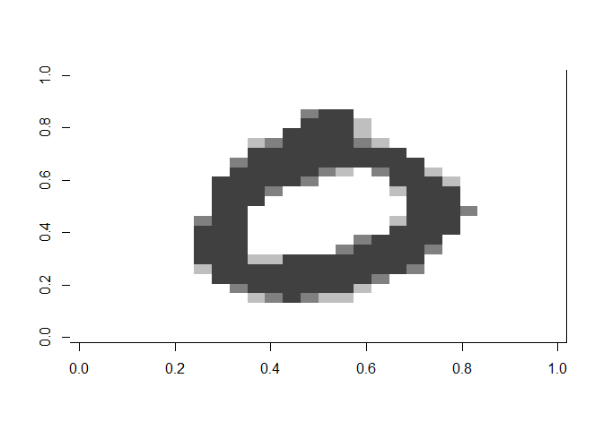

## Load the MNIST test dataset and create a small set of 3 digits


```r
# load mnist
mnsit <- read.csv(file="data/mnist_test.csv")

# number of exemplars per digit
n_digits <- 200 


# create dataset
d1 <- mnsit[mnsit$X7 == 1,]
d1 <- as.matrix(d1[1:n_digits,2:785], nrow = n_digits, ncol = 784)

show_digit(d1[1,])
```

<!-- -->

```r
d2 <- mnsit[mnsit$X7 == 8,]
d2 <- as.matrix(d2[1:n_digits,2:785], nrow = n_digits, ncol = 784)
show_digit(d2[1,])
```

<!-- -->

```r
d3 <- mnsit[mnsit$X7 == 0,]
d3 <- as.matrix(d3[1:n_digits,2:785], nrow = n_digits, ncol = 784)
show_digit(d3[1,])
```

<!-- -->

```r
digits_sample_2 <- rbind(d1,d2,d3)
rm(mnsit, d1, d2, d3)


# recode greyscale to black and white
digits_sample_2[digits_sample_2 > 0] <- 1

# look to the first observation
show_digit(digits_sample_2[1,])
```

<!-- -->

```r
show_digit(digits_sample_2[201,])
```

<!-- -->

```r
show_digit(digits_sample_2[401,])
```

<!-- -->

## Use a mixture model to estimate whether each pixel is a 1 or 0 for three clusters

### Determine whether a mixture model will recreate the three digits


```r
set.seed(11323)
# Fit Bernoulli mixture model
bernoulli_mix_model <- flexmix(digits_sample_2 ~ 1,
                               k = 3,
                               model = FLXMCmvbinary(),
                               control = list(tolerance = 1e-15, iter.max = 1000))
# Check the proportions
prior(bernoulli_mix_model)
```

```
## [1] 0.2816366 0.3900911 0.3282723
```

## Visualize the clusters


```r
# Extract the parameters for each cluster
param_comp_1 <- parameters(bernoulli_mix_model, component = 1)
param_comp_2 <- parameters(bernoulli_mix_model, component = 2)
param_comp_3 <- parameters(bernoulli_mix_model, component = 3)

# Visualize the clusters
show_digit(param_comp_1)
```

<!-- -->

```r
show_digit(param_comp_2)
```

<!-- -->

```r
show_digit(param_comp_3)
```

<!-- -->
