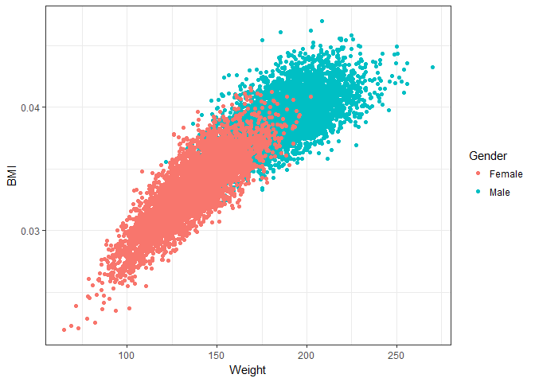
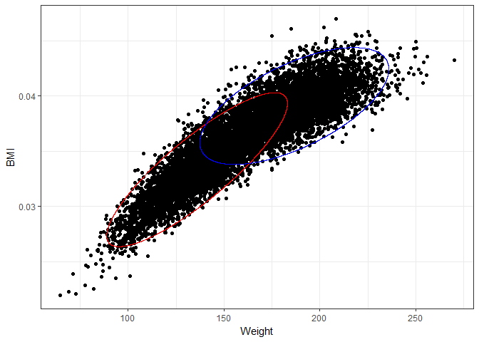

## Model gender sub-groups using weight and BMI 


## Plot Weight*BMI ~ Gender


```r
# Plot the ellipses
gender %>% 
  ggplot(aes(x = Weight, y = BMI)) + geom_point(aes(colour = Gender))+
  theme_bw()
```

<!-- -->

## Fit mixture model using multivariate gaussian


```r
set.seed(1313)
fit_with_covariance <- flexmix(cbind(Weight , BMI) ~ 1,
               data = gender,
               k = 2, 
               model = FLXMCmvnorm(diag = FALSE),
               control = list(tolerance = 1e-15, iter.max = 1000))
```


## Extract parameters


```r
# Get the parameters
comp_1 <- parameters(fit_with_covariance, component = 1)
comp_2 <- parameters(fit_with_covariance, component = 2)

# The means
mean_comp_1 <- comp_1[1:2]
mean_comp_1
```

```
## [1] 135.97738684   0.03334097
```

```r
mean_comp_2 <- comp_2[1:2]
mean_comp_2
```

```
## [1] 186.6849545   0.0391035
```

```r
# The covariance matrices
covariance_comp_1 <- matrix(comp_1[3:6], nrow = 2)
covariance_comp_1
```

```
##              [,1]         [,2]
## [1,] 370.85097460 4.712215e-02
## [2,]   0.04712215 8.103393e-06
```

```r
covariance_comp_2 <- matrix(comp_2[3:6], nrow = 2)
covariance_comp_2
```

```
##              [,1]         [,2]
## [1,] 405.22840542 2.742036e-02
## [2,]   0.02742036 4.668417e-06
```

## Plot model over data


```r
# Create ellipse curve 1
ellipse_comp_1 <- ellipse(x = covariance_comp_1, 
                          centre = mean_comp_1,
                          npoints = nrow(gender))
head(ellipse_comp_1)
```

```
##             x          y
## [1,] 181.4301 0.04005980
## [2,] 181.4223 0.04006096
## [3,] 181.4144 0.04006212
## [4,] 181.4065 0.04006327
## [5,] 181.3986 0.04006442
## [6,] 181.3906 0.04006557
```

```r
# Create ellipse curve 2
ellipse_comp_2 <- ellipse(x = covariance_comp_2, 
                          centre = mean_comp_2,
                          npoints = nrow(gender))

# Plot the ellipses
gender %>% 
  ggplot(aes(x = Weight, y = BMI)) + geom_point()+
  geom_path(data = data.frame(ellipse_comp_1), aes(x=x,y=y), col = "red") +
  geom_path(data = data.frame(ellipse_comp_2), aes(x=x,y=y), col = "blue") +
  theme_bw()
```

<!-- -->


## Check the assignments

```r
table(gender$Gender, clusters(fit_with_covariance))
```

```
##         
##             1    2
##   Female 4540  460
##   Male    386 4614
```
