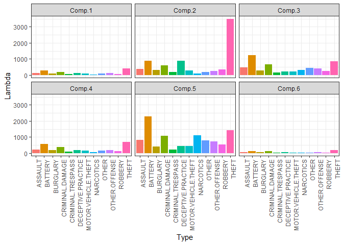
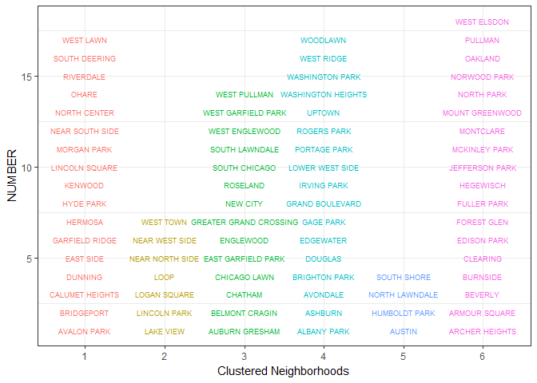

## Model clusters of neighborhoods by crime rates


```r
crimes <- read.csv("data/CoC_crimes.csv")
crimes_matrix <- as.matrix(crimes[,-1])
```

## Fit mixture model using poisson distributions
-  There are 15 different categories of crimes
-  find best fitting set of clusters (1 to 12) for crime categories (each neighborhood provides an observation)
-  Determine which neighborhoods fall within each cluster


```r
set.seed(11234)
poisson_mix_model <- stepFlexmix(crimes_matrix ~ 1, 
                                 k = 1:12, 
                                 nrep = 20, 
                                 model = FLXMCmvpois(),
                                 control = list(tolerance = 1e-15, iter = 1000))
```

```
## 1 : * * * * * * * * * * * * * * * * * * * *
## 2 : * * * * * * * * * * * * * * * * * * * *
## 3 : * * * * * * * * * * * * * * * * * * * *
## 4 : * * * * * * * * * * * * * * * * * * * *
## 5 : * * * * * * * * * * * * * * * * * * * *
## 6 : * * * * * * * * * * * * * * * * * * * *
## 7 : * * * * * * * * * * * * * * * * * * * *
## 8 : * * * * * * * * * * * * * * * * * * * *
## 9 : * * * * * * * * * * * * * * * * * * * *
## 10 : * * * * * * * * * * * * * * * * * * * *
## 11 : * * * * * * * * * * * * * * * * * * * *
## 12 : * * * * * * * * * * * * * * * * * * * *
```

## Use BIC method to determine which model was best


```r
best_fit <- getModel(poisson_mix_model, which = "BIC")

prior(best_fit)
```

```
## [1] 0.22077922 0.09090909 0.18181818 0.22077922 0.05194805 0.23376623
```

```r
param_pmm <- data.frame(parameters(best_fit))

param_pmm <- param_pmm %>% mutate(Type = colnames(crimes_matrix))

head(param_pmm)
```

```
##      Comp.1   Comp.2    Comp.3    Comp.4  Comp.5    Comp.6
## 1 112.41176 369.1429  487.7143 212.11765  821.75  58.72222
## 2 270.35294 891.5714 1243.5000 561.52941 2271.50 127.33333
## 3  88.94118 305.8571  269.7143 173.17647  418.00  50.83333
## 4 189.47059 590.4286  657.5000 367.35294 1074.50 106.61111
## 5  47.41176 192.8571  142.7143  78.41176  223.75  23.83333
## 6 138.23529 887.4286  232.0714 196.94118  438.00  62.94444
##                 Type
## 1            ASSAULT
## 2            BATTERY
## 3           BURGLARY
## 4    CRIMINAL.DAMAGE
## 5  CRIMINAL.TRESPASS
## 6 DECEPTIVE.PRACTICE
```

## Plot clusters by crime rates


```r
param_pmm %>% 
  gather(Components, Lambda, -Type) %>% 
  ggplot(aes(x = Type, y = Lambda, fill = Type)) + 
  geom_bar(stat = "identity") +
  facet_wrap(~ Components) +
  theme_bw() +
  theme(axis.text.x = element_text(angle = 90, hjust = 1), 
        legend.position = "none")
```

<!-- -->

## Show which neighborhoods that fall within each cluster
- Clusters 2, 3, and 5 have the highest crime rates
- Clusters 6 and 1 have the lowest


```r
crimes_c <- crimes %>% 
  mutate(CLUSTER = factor(clusters(best_fit)))

crimes_c %>% 
  group_by(CLUSTER) %>% 
  mutate(NUMBER = row_number()) %>% 
  ggplot(aes(x = CLUSTER, y = NUMBER, col = CLUSTER)) + 
  geom_text(aes(label = COMMUNITY), size = 2.3)+
  theme_bw() +
  theme(legend.position="none") +
  labs(x = "Clustered Neighborhoods")
```

<!-- -->

