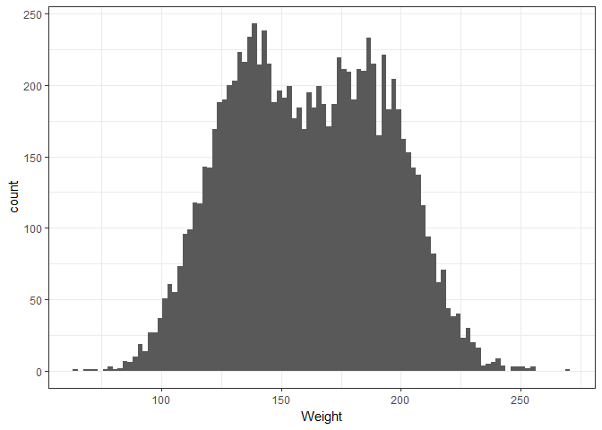
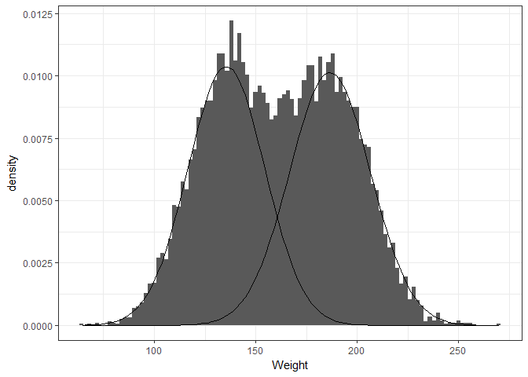

## Model gender sub-groups using weight


## Plot histogram of Weight ~ Gender


```r
gender %>% ggplot(aes(x = Weight)) + geom_histogram(bins = 100) + theme_bw()
```

<!-- -->

## Use mixture model to estimate parameters of two gaussian distributions from the gender data


```r
fit_mixture <- flexmix(Weight ~ 1,    # the means and sds are constant
                       data = gender, # the data frame
                       k = 2,         # the number of clusters,
                       model = FLXMCnorm1(),      # univariate Gaussian
                       control = list(tol = 1e-15, # tolerance for EM stop
                                      verbose = 0, # show partial results
                                      iter = 1e4)  # max number of iterations
                       ) 

# proportions of data assigned to each cluster
proportions <- prior(fit_mixture)
proportions
```

```
## [1] 0.4929666 0.5070334
```

```r
# parameters estimated by the model
parameters(fit_mixture)
```

```
##         Comp.1    Comp.2
## mean 135.54712 186.61523
## sd    18.94874  19.96247
```

## Visualize estimated parameters over data


```r
fun_prop <- function(x, mean, sd, proportion){
  proportion * dnorm(x = x, mean = mean, sd = sd)
}

comp_1 <- parameters(fit_mixture, component = 1)
comp_2 <- parameters(fit_mixture, component = 2)


gender %>%
 ggplot() + geom_histogram(aes(x = Weight, y = ..density..), binwidth = 2) +
  stat_function(geom = "line", fun = fun_prop, args = list(mean = comp_1[1], 
                                                           sd = comp_1[2],
                                                           proportion = proportions[1])
                ) +
  stat_function(geom = "line", fun = fun_prop, args = list(mean = comp_2[1],
                                                           sd = comp_2[2],
                                                           proportion = proportions[2])
                ) +
  theme_bw()
```

<!-- -->


## Create table of categorization accuracy


```r
# table of assignmentment accuracy
table(gender$Gender, clusters(fit_mixture))
```

```
##         
##             1    2
##   Female 4500  500
##   Male    444 4556
```
