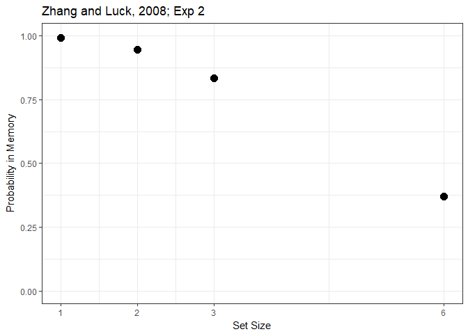
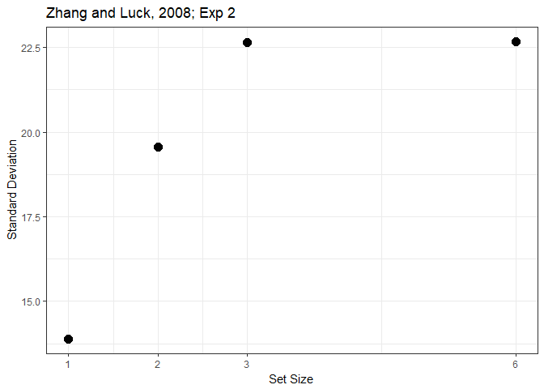

## Replicate Zhang and Luck, 2008, Exp 2 using Expectation Maximization functions


## Load data


```r
data <- c()
for (n in 1:8){
  temp <- readMat(con = paste0("data/E2_subject_", n, ".mat"))
  temp <- cbind(unlist(temp$data[[1]][1,]),
                   unlist(temp$data[[3]][1,]),
                   rep(n, 500))
  data <- rbind(data, temp)
}

data <- data.frame(
  errors  = data[,1],
  setsize = data[,2],
  subject = data[,3]
)

data$setsize <- as.factor(data$setsize)
data$subject <- as.factor(data$subject)

raw_data <- data

data <- raw_data %>%
  group_by(subject, setsize) %>%
  mutate(errors = errors*(180/pi)) %>%
  mutate(error_discrete = cut(errors,breaks=seq(from=-180,to=180,by=20),labels=FALSE))

summary <- data %>%
  group_by(subject, setsize, error_discrete) %>%
  summarise (n = n()) %>%
  mutate(errors = n / sum(n)) %>%
  select(-n)


# functions require a target and response, the data is already coded as error degrees
data$target <- 0

# convert to radians
data$errors_rad <- wrap(data$errors/180*pi)
data$target_rad <- wrap(data$target/180*pi)
```

## Fit mixture model using expectation maximization functions


```r
#get predictions
set_sizes        <- c(1, 2, 3, 6)

# placeholder
mm_data <- c()


for (s in set_sizes) {
  for (n in 1:8) {
    d <- data %>% filter(subject == n, setsize == s)
    m <- JV10_fit(X = d$errors_rad, Tg  = d$target_rad)
    
    mm_data <- rbind(mm_data, c(n, s, m$B$Pt, deg(k2sd(m$B$K))))
                     
  }
}
```


## Plot Probability and SD


```r
mm_data <- data.frame(
  subject = mm_data[,1],
  setsize = mm_data[,2],
  prob_g  = mm_data[,3],
  sd      = mm_data[,4]
)

mm_summary <- mm_data %>%
  group_by(setsize) %>%
  summarize(prob_memory = (mean(prob_g)),
            mean_sd = mean(sd)
  )

mm_summary
```

```
## # A tibble: 4 x 3
##   setsize prob_memory mean_sd
##     <dbl>       <dbl>   <dbl>
## 1       1       0.992    13.9
## 2       2       0.946    19.6
## 3       3       0.833    22.6
## 4       6       0.371    22.7
```

```r
ggplot(mm_summary, aes(x = setsize, y = prob_memory)) + 
  geom_point(size = 3.5)+
  theme_bw() +
  scale_y_continuous(limits = c(0,1)) +
  scale_x_continuous(breaks = c(1,2,3,6)) +
  labs(x = "Set Size", y = "Probability in Memory", title = "Zhang and Luck, 2008; Exp 2")
```

<!-- -->

```r
ggplot(mm_summary, aes(x = setsize, y = mean_sd)) + 
  geom_point(size = 3.5)+
  theme_bw() +
  #scale_y_continuous(limits = c(0,1)) +
  scale_x_continuous(breaks = c(1,2,3,6)) +
  labs(x = "Set Size", y = "Standard Deviation", title = "Zhang and Luck, 2008; Exp 2")
```

<!-- -->
